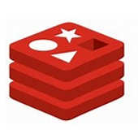
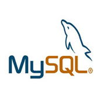

#  SQL and NoSQL databases 

##  [MongoDB](https://www.mongodb.com/)

 developers often consider `MongoDB` to be the main choice when building a data-driven application. However, many alternatives may provide better solutions.

This repository was built with the intention of exploring various database options to connect to Node.js backend such as:

1. MongoDB  (shopper and maxcoin)
2. Redis    (maxcoin)  
3. MySQL.

CRUD operations was built by using JS classes and instances. 

Databases installed by pulling docker image from  hub 

##  [Redis](https://redis.io/)

An important subset of NoSQL databases are key value stores. While key value stores are very limited, they're also very powerful and fast. `Redis` basically stores the data in memory which makes it blazingly fast but also, the data might get lost, if you kill the `Redis` process. 
Redis is often used as a cache. It can also be used as a storage when the consistency requirements are not high.

### [ioRedis](https://www.npmjs.com/package/ioredis)
A robust, performance-focused and full-featured Redis client for Node.js.
Unlike NodeRedis, ioRedis support `promises`

##  [MySQL](https://www.mysql.com/)